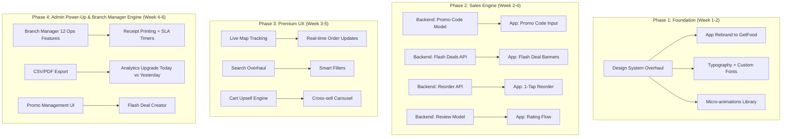

# 🚀 GetFood — Complete UI/UX & Sales Transformation Plan

> **Rebrand**: FoodSphere → **GetFood** (app name only — restaurant brands keep their own names)
> **Visual Direction**: Premium/luxury feel — better than Foodpanda
> **Scope**: Full roadmap — Mobile App + Admin Panel + Backend API
> **Platforms**: 📱 React Native/Expo App · 🖥️ React Vite Admin · 🐍 Django DRF Backend

---

## User Review Required

> [!IMPORTANT]
> **App Rebrand**: All references to "FoodSphere" in the mobile app will change to "GetFood". Admin panel and websites remain unchanged.

> [!IMPORTANT]
> **Backend Scope Clarified**: New backend models + endpoints will be built ONLY for: Reorder API, Flash Deals system, Ratings & Reviews, Live Tracking, Promo Codes, and Branch Manager Operations.

> [!WARNING]
> **Breaking Changes**: The design token overhaul (Phase 1) will touch every screen file. This is intentional — all hardcoded colors/sizes get replaced with centralized tokens for consistency and dark mode readiness.

---

## Architecture Overview



---

## Phase 1 — Design Foundation & Rebrand (Week 1-2)

### 1.1 Design System Overhaul

#### [MODIFY] [theme.ts](file:///d:/sitesdata/Resturent App/app/src/theme.ts)
**Current Problem**: 
- Only 11 colors defined. Screens bypass tokens with 50+ hardcoded hex values.
- No dark mode support. No neutral gray scale. No semantic tokens.
- Typography uses system fonts with arbitrary sizes scattered across screens.

**Changes**:
```
NEW COLOR SYSTEM (Premium/Luxury Palette):
├── Primary:     #E8364E (Vibrant Coral Red — appetite-stimulating, premium)
├── Secondary:   #FF8C42 (Warm Amber)  
├── Accent:      #6C63FF (Electric Violet — premium differentiator)
├── Dark:        #0F0F1A (Deep Space Black)
├── Surface:     #1A1A2E → #16162A (Darker, richer surface)
├── Card:        #1E1E36 (Elevated card surface)
├── Neutrals:    50-900 scale (10 shades)
├── Success:     #00C48C (Mint Green — modern)
├── Warning:     #FFB020 (Warm Amber)
├── Danger:      #FF4757 (Soft Red)
├── Gradient:    ['#E8364E', '#FF6B6B'] (Primary gradient pair)
└── Overlay:     rgba(0,0,0,0.6) (Consistent backdrop)

NEW TYPOGRAPHY SYSTEM:
├── Font Family: 'Plus Jakarta Sans' (Google Fonts — geometric, premium)
├── Display:     32px / 800 weight (Hero text)
├── H1:          26px / 700
├── H2:          22px / 700  
├── H3:          18px / 600
├── Body:        15px / 400
├── BodyBold:    15px / 600
├── Caption:     12px / 500
├── Price:       18px / 800 (Tabular numbers)
└── Badge:       10px / 700 (Uppercase, letter-spacing: 1.5)

NEW SPACING SCALE (8px base grid):
├── 2, 4, 8, 12, 16, 20, 24, 32, 40, 48, 64

NEW SHADOW SYSTEM:
├── sm:  { shadowOffset: {0,2}, shadowRadius: 8, shadowOpacity: 0.08 }
├── md:  { shadowOffset: {0,4}, shadowRadius: 16, shadowOpacity: 0.12 }
├── lg:  { shadowOffset: {0,8}, shadowRadius: 32, shadowOpacity: 0.16 }
└── glow: { shadowColor: primary, shadowRadius: 20, shadowOpacity: 0.3 }
```

---

#### [NEW] [animations.ts](file:///d:/sitesdata/Resturent App/app/src/animations.ts)
Centralized Reanimated animation presets:
```
- buttonPress:     withSpring(0.96) on press, withSpring(1.0) on release
- cartBounce:      scale 1.0 → 1.3 → 1.0 with spring damping
- slideUp:         translateY(100) → 0 with spring
- fadeInScale:     opacity 0→1 + scale 0.9→1.0
- shimmerLoop:     infinite translateX gradient sweep
- countBadgePulse: scale pulse on value change
- swipeDelete:     translateX with haptic at threshold
- staggerChildren: sequential 50ms delay per item in lists
```

---

#### Hardcoded Color Cleanup (ALL screens)
Every screen file must be swept to replace raw hex values with theme tokens:

| File | Lines with hardcoded colors | Action |
|---|---|---|
| [HomeScreen.tsx](file:///d:/sitesdata/Resturent App/app/src/screens/HomeScreen.tsx) | 811, 813, 824, 834 (guest banner) + 173, 516, 526, 573 (font sizes) | Replace with `COLORS.*` and `TYPOGRAPHY.*` |
| [RestaurantScreen.tsx](file:///d:/sitesdata/Resturent App/app/src/screens/RestaurantScreen.tsx) | 82, 116, 769, 1115, 1135, 1173, 1181 | Replace all `#fee2e2`, `#dc2626`, `#94a3b8`, `#f8fafc` etc. |
| [CartScreen.tsx](file:///d:/sitesdata/Resturent App/app/src/screens/CartScreen.tsx) | Multiple inline paddings and border radii | Standardize to `SPACING.*` and `RADIUS.*` |
| [CheckoutScreen.tsx](file:///d:/sitesdata/Resturent App/app/src/screens/CheckoutScreen.tsx) | 584, 708 (font sizes 10px, 12px) | Use `TYPOGRAPHY.caption` / `TYPOGRAPHY.badge` |
| [TrackingScreen.tsx](file:///d:/sitesdata/Resturent App/app/src/screens/TrackingScreen.tsx) | 544-563 (testing guide card) | Theme cleanup |

---

### 1.2 App Rebrand: FoodSphere → GetFood

#### [MODIFY] [app.json](file:///d:/sitesdata/Resturent App/app.json)
- Change `name`, `displayName` to "GetFood"

#### [MODIFY] All screens referencing "FoodSphere"
- Splash screen logo text
- Home screen header / greeting
- Profile screen app name references
- Onboarding screen branding
- About/Settings sections

---

### 1.3 Micro-animation & Haptic Polish

#### [MODIFY] All touchable elements across screens
**Current**: Plain `TouchableOpacity` with `activeOpacity={0.75}` everywhere.

**Upgrade to**:
- `Pressable` with Reanimated `useAnimatedStyle` for scale-down spring on press
- `expo-haptics` light impact on cart add, medium on delete, success on order placed
- `LayoutAnimation.configureNext()` on cart item add/remove for smooth height transitions
- Spring bounce on cart badge count change

#### [MODIFY] [SkeletonLoader.tsx](file:///d:/sitesdata/Resturent App/app/src/components/SkeletonLoader.tsx)
**Current (lines 76-85)**: Only `RestaurantCardSkeleton` exists (basic 160px box).

**Add new skeleton variants**:
- `MenuItemSkeleton` — for restaurant menu loading
- `OrderCardSkeleton` — for orders screen
- `SearchResultSkeleton` — for search results
- `RewardCardSkeleton` — for rewards screen
- `TrackingStatusSkeleton` — for tracking screen

---

## Phase 2 — Sales Engine Features (Week 2-4)

### 2.1 Backend: Promo Code System

#### [NEW] `backend/promotions/` Django App
**Models**:
```python
class Coupon(AuditLogMixin, models.Model):
    code           = models.CharField(max_length=30, unique=True, db_index=True)
    discount_type  = models.CharField(choices=[('percentage','%'), ('flat','Flat Rs.')])
    discount_value = models.DecimalField(max_digits=10, decimal_places=2)
    min_subtotal   = models.DecimalField(default=0)    # Minimum cart value
    max_discount   = models.DecimalField(null=True)     # Cap for percentage discounts
    restaurant     = models.ForeignKey('restaurants.Restaurant', null=True, blank=True)  # null = platform-wide
    valid_from     = models.DateTimeField()
    valid_to       = models.DateTimeField()
    usage_limit    = models.IntegerField(default=100)   # Total redemptions allowed
    per_user_limit = models.IntegerField(default=1)     # Per customer limit
    is_active      = models.BooleanField(default=True)
    
class CouponUsage(models.Model):
    coupon  = models.ForeignKey(Coupon)
    user    = models.ForeignKey(User, null=True)        # null for guest users
    order   = models.ForeignKey('orders.Order')
    used_at = models.DateTimeField(auto_now_add=True)
```

**Endpoints**:
- `POST /api/coupons/validate/` — Validates code, returns discount preview
- `GET /api/coupons/active/` — Lists currently active platform coupons

**Integration with Order flow**:
- Modify `OrderCreateSerializer.create()` to accept `coupon_code` field
- Calculate and apply discount atomically during order creation
- Log `CouponUsage` record
- Return applied discount in order response

---

### 2.2 Backend: Flash Deals System

#### [NEW] Models in `backend/promotions/`
```python
class FlashDeal(AuditLogMixin, models.Model):
    title          = models.CharField(max_length=100)
    description    = models.TextField(blank=True)
    deal_type      = models.CharField(choices=[
        ('bogo', 'Buy 1 Get 1'),
        ('percentage', '% Off'),
        ('flat', 'Flat Rs. Off'),
        ('combo', 'Combo Deal'),
    ])
    discount_value = models.DecimalField(max_digits=10, decimal_places=2, default=0)
    restaurant     = models.ForeignKey('restaurants.Restaurant', null=True, blank=True)
    menu_items     = models.ManyToManyField('restaurants.MenuItem', blank=True)
    image          = models.URLField(blank=True)        # Cloudinary banner image
    starts_at      = models.DateTimeField()
    ends_at        = models.DateTimeField()
    is_active      = models.BooleanField(default=True)
    max_orders     = models.IntegerField(default=0)     # 0 = unlimited
    orders_used    = models.IntegerField(default=0)
```

**Endpoints**:
- `GET /api/deals/active/` — Returns currently live deals with countdown seconds
- `GET /api/deals/<id>/` — Deal detail with applicable menu items

---

### 2.3 Backend: Reorder API

#### [NEW] Endpoint in `backend/orders/views.py`
```python
# POST /api/orders/<id>/reorder/
# Returns structured cart payload from a past order:
# {
#   "restaurant_id": 1,
#   "restaurant_name": "Seen Banao",
#   "items": [
#     {"menu_item_id": 45, "name": "Malai Boti", "quantity": 2, "price": 650, "variant": "Full"},
#     ...
#   ],
#   "unavailable_items": [
#     {"menu_item_id": 12, "name": "Reshmi Kabab", "reason": "out_of_stock"}
#   ]
# }
```
- Validates each item still exists and is available (`is_available=True`)
- Returns separate list of unavailable items so app can show partial reorder alert
- Customer must own the original order (auth check)

---

### 2.4 Backend: Ratings & Reviews

#### [NEW] Model in `backend/orders/models.py`
```python
class OrderReview(AuditLogMixin, models.Model):
    order           = models.OneToOneField(Order, related_name='review')
    user            = models.ForeignKey(User, null=True)
    restaurant      = models.ForeignKey('restaurants.Restaurant')
    food_rating     = models.IntegerField(validators=[MinValueValidator(1), MaxValueValidator(5)])
    delivery_rating = models.IntegerField(validators=[MinValueValidator(1), MaxValueValidator(5)])
    comment         = models.TextField(blank=True, max_length=500)
    created_at      = models.DateTimeField(auto_now_add=True)
```

**Endpoints**:
- `POST /api/orders/<id>/review/` — Submit review (only for delivered orders)
- `GET /api/restaurants/<slug>/reviews/` — Paginated reviews list
- Auto-update `Restaurant.rating` as running average via post_save signal

---

### 2.5 App: Promo Code Input

#### [MODIFY] [CartScreen.tsx](file:///d:/sitesdata/Resturent App/app/src/screens/CartScreen.tsx)
**Current (line 249)**: Hardcoded discount string `— Rs. 0`

**Add**:
- Promo code input field with "Apply" button above bill summary
- Loading state while validating with backend
- Success state showing applied discount amount with green badge
- Error state for invalid/expired codes with shake animation
- Applied coupon chip with "×" to remove

#### [MODIFY] [CheckoutScreen.tsx](file:///d:/sitesdata/Resturent App/app/src/screens/CheckoutScreen.tsx)
- Pass validated `coupon_code` in order creation payload
- Show applied discount in final order summary

---

### 2.6 App: Flash Deal Banners & Countdown

#### [MODIFY] [HomeScreen.tsx](file:///d:/sitesdata/Resturent App/app/src/screens/HomeScreen.tsx)
**Current (lines 74-145)**: Auto-rotating `setInterval` banner with static text and icons.

**Replace with**:
- Touch-swipeable `FlatList` horizontal carousel (snap to center)
- Each banner shows: deal image, title, countdown timer (HH:MM:SS), "Order Now" CTA
- Countdown uses `useEffect` + `setInterval` with live seconds calculation from `ends_at`
- Expired deals auto-filter out
- Pulsing urgency animation when < 1 hour remaining
- Fetches from `GET /api/deals/active/`

---

### 2.7 App: 1-Tap Reorder

#### [MODIFY] [OrdersScreen.tsx](file:///d:/sitesdata/Resturent App/app/src/screens/OrdersScreen.tsx)
**Add per delivered order card**:
- "Reorder" button (gradient CTA, repeat icon)
- On tap: calls `POST /api/orders/<id>/reorder/`
- If all items available → auto-populate cart → navigate to CartScreen
- If some unavailable → show modal: "2 items unavailable. Add available items to cart?"
- Smooth loading state with skeleton on the button

---

### 2.8 App: Ratings & Reviews Flow

#### [NEW] [ReviewScreen.tsx](file:///d:/sitesdata/Resturent App/app/src/screens/ReviewScreen.tsx) or Modal
Triggered after order delivery (from TrackingScreen success state):
- 5-star rating selector with animated fill (food + delivery separate)
- Optional text comment with character counter
- Submit with celebratory confetti animation
- "Skip" option (non-intrusive)

#### [MODIFY] [RestaurantScreen.tsx](file:///d:/sitesdata/Resturent App/app/src/screens/RestaurantScreen.tsx)
- Add "Reviews" tab in restaurant detail
- Show average rating with star breakdown bar chart
- Paginated review cards with user initial avatars

---

## Phase 3 — Premium UX Overhaul (Week 3-5)

### 3.1 Live Map Order Tracking

#### [MODIFY] [TrackingScreen.tsx](file:///d:/sitesdata/Resturent App/app/src/screens/TrackingScreen.tsx)
**Current (lines 146-239)**: Custom animated stage illustrations (Radar, Cooking, Rider, Success) — these are well-executed and should be PRESERVED.

**Add below the stage animations**:
- `react-native-maps` `MapView` component with:
  - Restaurant marker (cooking pot icon)
  - Customer marker (home pin)
  - Rider marker (scooter icon) — initially static, positioned at restaurant
  - Route polyline between restaurant → customer (Google Directions API)
  - Smooth rider marker animation along route when status = "out_for_delivery"
- Status-based map behavior:
  - `preparing`: Map shows restaurant location only, zoomed in
  - `out_for_delivery`: Map shows full route with animated rider marker
  - `delivered`: Map hides, success celebration shows
- Estimated time badge overlay on map
- "Call Restaurant" button during preparing phase

> [!IMPORTANT]
> The existing custom stage animations (Radar pulse, Cooking steam, Rider scooter, Success check) in lines 146-239 are high-quality and must be PRESERVED. The map augments them — it doesn't replace them.

---

### 3.2 Search UX Overhaul

#### [MODIFY] [SearchScreen.tsx](file:///d:/sitesdata/Resturent App/app/src/screens/SearchScreen.tsx)
**Current issues**:
- Line 100, 168-174: Recent searches lost on navigate away (useState only)
- Lines 124-166: Client-side filtering of fallback data only

**Changes**:
1. **Persistent recent searches** via `AsyncStorage` (save last 10)
2. **Debounced API search** (300ms) hitting backend `/api/restaurants/?search=` and `/api/menu-items/?search=`
3. **Filter bottom sheet** with:
   - Sort: Popular, Price ↑, Price ↓, Rating, Delivery Time
   - Cuisine type multi-select
   - Price range slider
   - Dietary: Halal, Vegetarian
4. **Rich result cards** showing: food image thumbnail, restaurant name, price, rating stars, delivery time badge
5. **Empty state** with cuisine category suggestions

---

### 3.3 Home Screen Premium Upgrade

#### [MODIFY] [HomeScreen.tsx](file:///d:/sitesdata/Resturent App/app/src/screens/HomeScreen.tsx)
**Current (lines 32-37, 592-612)**: Text emoji chips for cuisine categories.

**Changes**:
1. **Cuisine bubble grid**: Circular image thumbnails (generated via AI) for each category — replaces emoji text chips
2. **Flash deal carousel**: See Phase 2.6 above
3. **"Popular Near You" section**: Horizontal scroll of top-selling items (from `/api/restaurants/<slug>/popular-items/` if built) 
4. **Delivery address bar upgrade**: Show current address with pin icon + "Change" link → open interactive map picker modal (uses `react-native-maps`)
5. **Restaurant cards upgrade**:
   - Add delivery time badge (e.g., "25-35 min")
   - Add rating stars inline
   - Add "FREE DELIVERY" badge when applicable
   - Parallax image scroll effect on card
6. **Greeting personalization**: "Good evening, Ahmad 👋" with time-of-day awareness

---

### 3.4 Cart & Checkout Premium UX

#### [MODIFY] [CartScreen.tsx](file:///d:/sitesdata/Resturent App/app/src/screens/CartScreen.tsx)
1. **Swipe-to-delete upgrade** (lines 40-73): Add spring physics + haptic feedback (expo-haptics medium impact at delete threshold)
2. **Cross-sell section**: "Frequently Ordered With This" horizontal carousel before checkout button (initially populated from same restaurant's featured items)
3. **Itemized bill**: Add GST/Tax line, Service Fee line, Packaging Fee
4. **Minimum order progress bar**: Visual progress toward free delivery threshold
5. **Empty cart state**: Illustrated empty plate with "Browse Restaurants" CTA

#### [MODIFY] [CheckoutScreen.tsx](file:///d:/sitesdata/Resturent App/app/src/screens/CheckoutScreen.tsx)
1. **Address fields upgrade** (lines 491-524): Break single textarea into structured fields:
   - Street address (auto-filled from GPS)
   - Building/House number
   - Landmark (optional)
   - Map thumbnail preview with "Adjust Pin" button
2. **Order summary collapsible card** at top
3. **Delivery instructions** text field (e.g., "Ring doorbell twice")
4. **Place Order button** with loading state animation (pulsing gradient)

---

### 3.5 Restaurant Screen Polish

#### [MODIFY] [RestaurantScreen.tsx](file:///d:/sitesdata/Resturent App/app/src/screens/RestaurantScreen.tsx)
1. **Sticky category tabs** (lines 504-549): Convert from filter-in-memory to scroll-to-section with `SectionList` + active tab highlighting on scroll
2. **Floating cart bar** (lines 591-610): Add slide-up spring animation + minimum order progress bar + item count badge with bounce
3. **Item customization upgrade** (lines 613-704): Add per-item special instructions text field + add-on checkbox groups
4. **Menu loading** (lines 394-401): Replace full-screen `ActivityIndicator` with `MenuItemSkeleton` components
5. **"Popular" badge** on top-selling items
6. **Item image lazy loading** with blur-up placeholder

---

## Phase 4 — Admin Panel Power-Up & Branch Manager Operations Engine (Week 4-6)

### 4.1 Branch Manager Operations Engine (Exhaustive 12-Feature Code Specification)

#### 1. Per-Branch Item Stock Overrides
- **Backend Model**: `[NEW]` [BranchMenuItemAvailability](file:///d:/sitesdata/Resturent App/backend/restaurants/models.py)
  ```python
  class BranchMenuItemAvailability(models.Model):
      branch       = models.ForeignKey('restaurants.Branch', on_delete=models.CASCADE, related_name='stock_overrides')
      menu_item    = models.ForeignKey('restaurants.MenuItem', on_delete=models.CASCADE, related_name='branch_availabilities')
      is_available = models.BooleanField(default=True)
      updated_at   = models.DateTimeField(auto_now=True)
      class Meta:
          unique_together = ('branch', 'menu_item')
  ```
- **Backend Serializer & View**: `[MODIFY]` [serializers.py](file:///d:/sitesdata/Resturent App/backend/restaurants/serializers.py) & [views.py](file:///d:/sitesdata/Resturent App/backend/restaurants/views.py)
  - `MenuItemSerializer` checks request context `branch_id`. If set, resolves `is_available` from `BranchMenuItemAvailability` override; falls back to `MenuItem.is_available`.
  - Endpoint: `POST /api/branches/<branch_id>/stock-override/` payload `{ "menu_item_id": 45, "is_available": false }`.
- **Admin UI**: `[MODIFY]` [MenuManagement.tsx](file:///d:/sitesdata/Resturent App/admin/src/views/MenuManagement.tsx)
  - When logged in as Branch Manager, stock toggle calls `api.updateBranchStock(branchId, itemId, isAvailable)`.
  - Shows clear indicator: "Branch Stock Override Active" vs "Brand Default".

#### 2. Per-Branch Operating Hours
- **Backend Model**: `[MODIFY]` [models.py](file:///d:/sitesdata/Resturent App/backend/restaurants/models.py)
  - Add `opens_at = models.TimeField(null=True, blank=True, help_text="Branch-specific opening time. Overrides restaurant opening time if set.")`
  - Add `closes_at = models.TimeField(null=True, blank=True, help_text="Branch-specific closing time. Overrides restaurant closing time if set.")`
- **Backend Serializer**: `[MODIFY]` [serializers.py](file:///d:/sitesdata/Resturent App/backend/restaurants/serializers.py)
  - Include `opens_at` and `closes_at` in `BranchSerializer`.
- **Admin UI**: `[MODIFY]` [BranchDashboard.tsx](file:///d:/sitesdata/Resturent App/admin/src/views/BranchDashboard.tsx)
  - Add "Operating Hours" section to Settings Modal with time pickers (`opens_at`, `closes_at`) and "Use Restaurant Defaults" checkbox.

#### 3. Strict Branch Order Isolation & Data Leak Prevention
- **Backend Permissions**: `[NEW]` [permissions.py](file:///d:/sitesdata/Resturent App/backend/config/permissions.py)
  ```python
  class IsBranchManager(permissions.BasePermission):
      def has_permission(self, request, view):
          return bool(request.user and request.user.is_authenticated and hasattr(request.user, 'manager_profile'))
  ```
- **Backend Views**: `[MODIFY]` [orders/views.py](file:///d:/sitesdata/Resturent App/backend/orders/views.py)
  - Replace loose `get_managed_branch` logic. Enforce hard `queryset.filter(branch=user.manager_profile.branch)` in `OrderListCreateView` and `OrderDetailView` for non-superadmin users.
  - Eliminate `Q(restaurant=...)` fallback leaks.
- **Admin Context**: `[MODIFY]` [AdminContext.tsx](file:///d:/sitesdata/Resturent App/admin/src/AdminContext.tsx)
  - Enforce `user.branchId` filtering on all client-side state arrays (`orders`, `notifications`).

#### 4. Manager Credential Self-Service
- **Backend Endpoint**: `[NEW]` `POST /api/users/manager-credentials/` in [users/views.py](file:///d:/sitesdata/Resturent App/backend/users/views.py)
  - Payload: `{ "current_password": "...", "new_password": "...", "notification_email": "manager@dha.com" }`
  - Validates `current_password`, sets `new_password`, updates `manager_profile.notification_email`.
- **Admin UI**: `[MODIFY]` [BranchDashboard.tsx](file:///d:/sitesdata/Resturent App/admin/src/views/BranchDashboard.tsx)
  - Add "Account & Security Settings" tab inside Branch Settings Modal with input validation and password strength meter.

#### 5. Branch Rider Directory & Dispatch Quick-Dial
- **Backend Model**: `[NEW]` [BranchRider](file:///d:/sitesdata/Resturent App/backend/restaurants/models.py)
  ```python
  class BranchRider(models.Model):
      branch       = models.ForeignKey('restaurants.Branch', on_delete=models.CASCADE, related_name='riders')
      name         = models.CharField(max_length=100)
      phone        = models.CharField(max_length=20)
      vehicle_type = models.CharField(max_length=50, default='Bike')
      is_active    = models.BooleanField(default=True)
      created_at   = models.DateTimeField(auto_now_add=True)
  ```
- **Backend Endpoints**: `GET/POST/DELETE /api/branches/<branch_id>/riders/`
- **Admin UI**: `[MODIFY]` [BranchDashboard.tsx](file:///d:/sitesdata/Resturent App/admin/src/views/BranchDashboard.tsx) & [OrderManagement.tsx](file:///d:/sitesdata/Resturent App/admin/src/views/OrderManagement.tsx)
  - Add "Rider Directory" card with inline CRUD.
  - On Order Cards, add rider dropdown + 1-tap WhatsApp (`https://wa.me/<phone>?text=Order%20#1234%20ready%20for%20pickup`) and Phone quick-dial buttons.

#### 6. Branch Force-Close & Emergency Outage Controls
- **Backend Model**: `[MODIFY]` [models.py](file:///d:/sitesdata/Resturent App/backend/restaurants/models.py)
  - Add `is_force_closed = models.BooleanField(default=False, help_text="Emergency outage override for kitchen overload")` to `Branch` model.
- **Admin UI**: `[MODIFY]` [BranchDashboard.tsx](file:///d:/sitesdata/Resturent App/admin/src/views/BranchDashboard.tsx)
  - Add prominent "Emergency Outage Toggle" switch with visual indicator: 🟢 Live vs 🔴 Temporarily Closed (Kitchen Overload).
  - Triggers instant API call `PATCH /api/branches/<id>/` updating `is_force_closed`.

#### 7. Order Rejection Flow with Preset & Custom Reasons
- **Backend Model**: `[MODIFY]` [orders/models.py](file:///d:/sitesdata/Resturent App/backend/orders/models.py)
  - Add `rejection_reason = models.TextField(blank=True, null=True)` to `Order` model.
- **Backend View**: `[MODIFY]` [orders/views.py](file:///d:/sitesdata/Resturent App/backend/orders/views.py)
  - When status updated to `cancelled`, serializer enforces mandatory `rejection_reason`.
- **Admin UI**: `[MODIFY]` [OrderManagement.tsx](file:///d:/sitesdata/Resturent App/admin/src/views/OrderManagement.tsx)
  - Clicking "Reject Order" presents modal with preset radio buttons:
    - ❌ Out of Delivery Range
    - 🍳 Kitchen Overload / Peak Delay
    - ⏱️ Branch Closing Soon
    - 📦 Menu Item Out of Stock
    - ✍️ Custom Reason (text input)
  - Rejection reason sent to backend and saved in order history.

#### 8. Audio Alerts & Unread Order Badging
- **Admin Context**: `[MODIFY]` [AdminContext.tsx](file:///d:/sitesdata/Resturent App/admin/src/AdminContext.tsx)
  - Initialize Web Audio API synthesizer chime / audio player (`/sounds/new_order_chime.mp3`).
  - On 5s polling cycle, if `orders` array contains new `pending` orders matching `user.branchId`:
    - Play audio chime (looping until acknowledged)
    - Trigger Web Notification API toast: `"New Order #1042 received ($1,250)"`
- **Sidebar & Header**: `[MODIFY]` [Sidebar.tsx](file:///d:/sitesdata/Resturent App/admin/src/components/Sidebar.tsx)
  - Render animated pulsing red count badge next to "Orders" tab.

#### 9. Scoped Customer Search & Branch Broadcasts
- **Backend Views**: `[MODIFY]` [users/views.py](file:///d:/sitesdata/Resturent App/backend/users/views.py)
  - `CustomerListView` accepts `branch_id` (or infers from manager token). Returns queryset filtered by `orders__branch_id=branch_id`.
- **Admin UI**: `[MODIFY]` [CustomerManagement.tsx](file:///d:/sitesdata/Resturent App/admin/src/views/CustomerManagement.tsx)
  - Enable Customer Management view for Branch Managers.
  - Shows customer name, phone, order count at this branch, total branch spend, and last order date.
  - Allows manager to send targeted branch push notification (e.g., "15% off at DHA Branch tonight!").

#### 10. Operational Performance Analytics (Today vs. Yesterday)
- **Backend API**: `[NEW]` `GET /api/branches/<branch_id>/analytics/` in [analytics_views.py](file:///d:/sitesdata/Resturent App/backend/config/analytics_views.py)
  - Returns JSON payload comparing Today vs Yesterday:
    ```json
    {
      "today": { "revenue": 45200, "orders": 34, "avg_prep_time_min": 18, "rejection_rate_pct": 2.9 },
      "yesterday": { "revenue": 38900, "orders": 29, "avg_prep_time_min": 22, "rejection_rate_pct": 6.8 }
    }
    ```
- **Admin UI**: `[MODIFY]` [BranchDashboard.tsx](file:///d:/sitesdata/Resturent App/admin/src/views/BranchDashboard.tsx)
  - Render comparative KPI cards showing Today's total vs. Yesterday's benchmark with green/red variance badges.

#### 11. Branch Activity Audit Trail
- **Backend Model & Mixin**: `[NEW]` `BranchActivityLog` model & `[MODIFY]` [mixins.py](file:///d:/sitesdata/Resturent App/backend/config/mixins.py)
  - Automatically records all manager actions: stock toggles, hours changes, force-close status changes, credential updates, order cancellations with reasons.
- **Admin UI**: `[NEW]` [BranchActivityLog.tsx](file:///d:/sitesdata/Resturent App/admin/src/views/BranchActivityLog.tsx)
  - Accessible via Sidebar for Branch Managers and Super-Admin. Shows searchable table of actions, actor username, action type, description, timestamp.

#### 12. Real-time Critical Alerts & Super-Admin Overrides
- **Admin Context**: `[MODIFY]` [AdminContext.tsx](file:///d:/sitesdata/Resturent App/admin/src/AdminContext.tsx)
  - Polling detects critical events:
    - Super-Admin applied master restaurant `is_force_closed`
    - Pending order exceeded 10-minute SLA threshold
  - Displays persistent top-of-screen emergency notification banner with action buttons.

---

### 4.2 Order Management Upgrades

#### [MODIFY] [OrderManagement.tsx](file:///d:/sitesdata/Resturent App/admin/src/views/OrderManagement.tsx)

1. **Order search bar** (NEW — currently missing entirely):
   - Search by Order ID `#`, Customer Name, Phone Number, Address
   - Real-time filtering as you type
   
2. **Receipt print button** per order card:
   - Thermal-friendly HTML receipt template (58mm/80mm width)
   - Uses `window.print()` with `@media print` CSS
   - Includes: Order ID, items + qty + price, subtotal, delivery fee, total, customer name, address, phone, timestamp
   
3. **SLA timer on pending orders**:
   - Live elapsed timer since `created_at` on each pending order card
   - Yellow warning badge at 5+ minutes
   - Red pulsing badge at 10+ minutes
   - Plays alert sound at SLA breach threshold

4. **Fix WhatsApp dispatch** (line 197-215): Replace hardcoded `923000000000` with branch-specific phone from `currentBranch.phone` or assigned rider phone

---

### 4.3 Analytics Dashboard Upgrade

#### [MODIFY] [SuperDashboard.tsx](file:///d:/sitesdata/Resturent App/admin/src/views/SuperDashboard.tsx)

1. **KPI cards with trend indicators** (lines 78-107):
   - Add percentage change vs previous period (↑ green / ↓ red arrows)
   - Add sparkline mini-graphs inside each card
   
2. **Date range picker**: Toggle between Today / This Week / This Month / Custom Range

3. **Fix sync badge text** (line 119): Change "Auto-Sync Active (15s)" to match actual 5s polling interval in AdminContext

#### [MODIFY] [AnalyticsCharts.tsx](file:///d:/sitesdata/Resturent App/admin/src/components/AnalyticsCharts.tsx)
1. **Multi-timeframe**: Replace fixed 7-day window (lines 14-25) with selectable ranges
2. **Dual metric overlay**: Revenue line + Order count bars on same chart
3. **Top 5 best-selling items** ranked bar chart
4. **Peak hours heatmap**: Grid showing order density by hour × day-of-week

---

### 4.4 CSV/PDF Export

#### [MODIFY] [OrderManagement.tsx](file:///d:/sitesdata/Resturent App/admin/src/views/OrderManagement.tsx) + [SuperDashboard.tsx](file:///d:/sitesdata/Resturent App/admin/src/views/SuperDashboard.tsx)

**Add "Export" dropdown button** with options:
- **CSV Export**: Client-side CSV generation from currently filtered orders array
  - Columns: Order ID, Date, Customer, Phone, Items, Subtotal, Delivery Fee, Discount, Total, Status, Payment Method
- **PDF Summary**: Daily/weekly summary using `jspdf` or `html2canvas`
  - Includes KPI summary + chart screenshot + order table

---

### 4.5 Promo Code & Flash Deal Management UIs (Admin)

#### [NEW] [PromoManagement.tsx](file:///d:/sitesdata/Resturent App/admin/src/views/PromoManagement.tsx)
Admin view for Super-Admin to:
- Create new promo codes (code, type, value, validity, limits, restaurant scope)
- View active/expired/upcoming promos in tabbed table
- See usage stats per code (redeemed count, total discount given)
- Toggle active/inactive
- Edit existing promos

#### [NEW] [FlashDealManagement.tsx](file:///d:/sitesdata/Resturent App/admin/src/views/FlashDealManagement.tsx)
Admin view for Super-Admin to:
- Create flash deals with image upload, menu item selection, countdown config
- View active/scheduled/expired deals
- See performance metrics (orders generated, revenue impact)
- Duplicate existing deals for quick reuse

---

### 4.6 Menu Management Polish

#### [MODIFY] [MenuManagement.tsx](file:///d:/sitesdata/Resturent App/admin/src/views/MenuManagement.tsx)
1. **Drag-and-drop reordering** using `@hello-pangea/dnd` for both categories and items
2. **Bulk stock toggle**: Select multiple items → toggle all available/unavailable per branch
3. **Image aspect ratio preview**: Show 1:1 crop preview before upload

---

### 4.7 Admin Sidebar Update

#### [MODIFY] [Sidebar.tsx](file:///d:/sitesdata/Resturent App/admin/src/components/Sidebar.tsx)
Add new navigation items:
- For Super-Admin: 🎟️ Promo Codes, ⚡ Flash Deals, ⭐ Reviews
- For Branch Managers: 👥 Branch Customers (scoped), 📋 Activity Log

---

## Phase 5 — Backend Infrastructure (Parallel with Phase 2-4)

### 5.1 New Django App: Promotions

#### [NEW] `backend/promotions/` app
```
promotions/
├── __init__.py
├── admin.py        # Django admin registration for Coupon, FlashDeal
├── models.py       # Coupon, CouponUsage, FlashDeal models
├── serializers.py  # CouponValidateSerializer, FlashDealSerializer
├── views.py        # CouponValidateView, ActiveDealsView
├── urls.py         # Route definitions
└── migrations/
```

### 5.2 Order Model Extensions

#### [MODIFY] `backend/orders/models.py`
- Add `coupon` ForeignKey (nullable) to Order model
- Add `OrderReview` model (see Phase 2.4)

#### [MODIFY] `backend/orders/serializers.py`
- Add `coupon_code` field to `OrderCreateSerializer`
- Implement coupon validation + discount calculation in `.create()`
- Add `ReorderSerializer` for reorder endpoint

#### [MODIFY] `backend/orders/views.py`
- Add `ReorderView` (`POST /api/orders/<id>/reorder/`)
- Add `OrderReviewCreateView` (`POST /api/orders/<id>/review/`)

### 5.3 Restaurant API Extensions

#### [MODIFY] `backend/restaurants/views.py`
- Add `RestaurantReviewsView` (`GET /api/restaurants/<slug>/reviews/`)
- Auto-aggregate rating via `post_save` signal on `OrderReview`

### 5.4 URL Registration

#### [MODIFY] `backend/config/urls.py`
- Include `promotions.urls`
- Add review and reorder routes

---

## Verification Plan

### Automated Tests

```bash
# Backend tests
cd backend
python manage.py test promotions --verbosity=2
python manage.py test orders.tests.test_reorder --verbosity=2
python manage.py test orders.tests.test_reviews --verbosity=2

# Frontend lint
cd admin && npm run lint
cd app && npx expo lint
```

### Manual Verification

1. **Promo Code Flow**: Create code in admin → Apply in app cart → Verify discount in order
2. **Flash Deals**: Create deal in admin → Verify countdown on app home → Place order with deal
3. **Reorder**: Complete an order → Go to Orders → Tap Reorder → Verify cart populated
4. **Reviews**: Complete order → Rate → Verify rating appears on restaurant page
5. **Live Tracking**: Place order → Update status in admin → Verify map + status updates in app
6. **CSV Export**: Filter orders in admin → Export CSV → Open in Excel → Verify data accuracy
7. **Receipt Print**: Click print on order card → Verify thermal-friendly layout
8. **Design System**: Visual audit of all screens for consistency — no hardcoded colors remaining
9. **Rebrand**: Search entire app codebase for "FoodSphere" → should return 0 results

### Deployment Verification
```bash
# Backend to Heroku
git subtree push --prefix backend heroku main

# Admin to Vercel  
cd admin && npx vercel --prod

# App build
cd app && eas build --platform android --profile preview
```

---

## Implementation Order & Dependencies

```
Week 1:  [1.1] Design System → [1.2] Rebrand → [1.3] Animations
Week 2:  [2.1] Promo Backend → [2.2] Flash Deals Backend → [2.3] Reorder Backend → [2.4] Reviews Backend  
Week 3:  [2.5] Promo App UI → [2.6] Flash Deals App UI → [2.7] Reorder App UI → [2.8] Reviews App UI
Week 4:  [3.1] Live Map → [3.2] Search → [3.3] Home Upgrade → [3.4] Cart/Checkout
Week 5:  [3.5] Restaurant Screen → [4.1] Order Mgmt → [4.2] Analytics → [4.3] Export
Week 6:  [4.4] Promo Admin → [4.5] Menu Polish → [4.6] Sidebar → Final QA + Deploy
```

> [!TIP]
> Backend work (Phase 5) runs in parallel with frontend work. Deploy backend models/endpoints first so frontend can integrate against live APIs.

---

## Summary of All New Files

| Type | File | Purpose |
|---|---|---|
| 📱 App | `app/src/animations.ts` | Centralized Reanimated animation presets |
| 📱 App | `app/src/screens/ReviewScreen.tsx` | Post-delivery rating flow |
| 🖥️ Admin | `admin/src/views/PromoManagement.tsx` | Promo code CRUD admin view |
| 🖥️ Admin | `admin/src/views/FlashDealManagement.tsx` | Flash deal CRUD admin view |
| 🐍 Backend | `backend/promotions/` (entire app) | Coupon, CouponUsage, FlashDeal models + APIs |

## Summary of All Modified Files

| Platform | Files Modified | Key Changes |
|---|---|---|
| 📱 App | 12 screen files + theme + components | Design tokens, animations, promo input, flash deals, reorder, reviews, live map, search |
| 🖥️ Admin | 6 view files + sidebar + charts | Search, print, SLA timers, export, analytics, promo/deal management |
| 🐍 Backend | orders (models, serializers, views) + restaurants (views) + config (urls) | Review model, reorder endpoint, coupon validation, deal endpoints |
